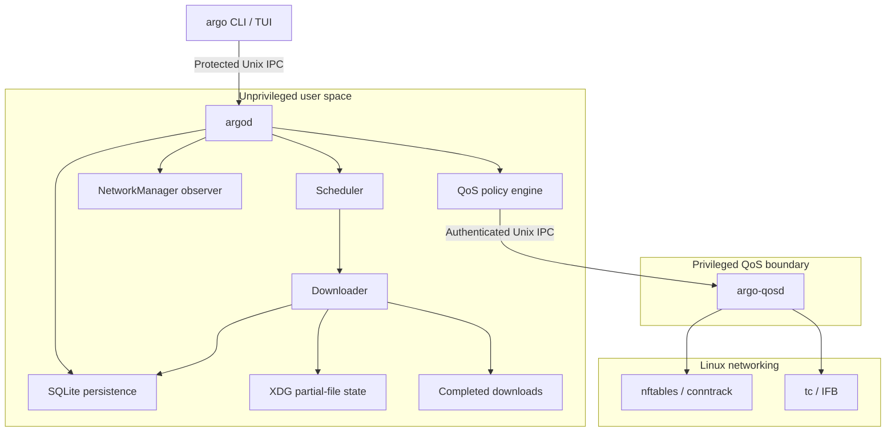

<p align="center">
  
</p>

# Argo

Argo is a terminal-first download manager for Linux. A persistent user daemon handles HTTP and HTTPS transfers while the CLI and TUI provide control, visibility, scheduling, and optional Linux-native traffic policies.

<p>
  <a href="#project-status"></a>
  <a href="#project-status"></a>
  
  
  <a href="LICENSE"></a>
  <a href="https://github.com/kristyancarvalho/argo/actions/workflows/ci.yml"></a>
  <a href="https://github.com/kristyancarvalho/argo/actions/workflows/tests.yml?query=branch%3Adev"></a>
</p>

`CI` reports formatting, vet, lint, and executable builds on `main`. `TESTS` reports the dedicated unit, integration, safe end-to-end, and race suite on `dev`.

## Table of contents

- [Overview](#overview)
- [Why Argo exists](#why-argo-exists)
- [Features](#features)
- [Architecture](#architecture)
- [Requirements](#requirements)
- [Build and installation](#build-and-installation)
- [Quick start](#quick-start)
- [CLI overview](#cli-overview)
- [Configuration](#configuration)
- [Traffic policies and priorities](#traffic-policies-and-priorities)
- [Project status](#project-status)
- [Development workflow](#development-workflow)
- [Testing](#testing)
- [Repository structure](#repository-structure)
- [Brand assets](#brand-assets)
- [License](#license)

## Overview

Argo separates download work from its interfaces. `argod` owns transfers, state, scheduling, and recovery; `argo` sends commands over a protected Unix socket; and `argo-qosd` is an optional, narrowly privileged helper for kernel traffic control. Closing the CLI or TUI does not stop the daemon's active downloads.

Completed files go to `$HOME/Downloads` by default. Internal partial data and the SQLite database live in separate XDG locations, so starting Argo from another working directory does not leave `.part` files there.

## Why Argo exists

Large downloads should not require an interactive client to remain open, overwrite existing files, or make the rest of a Linux system unusable. Argo combines durable download management with explicit queue priorities and optional receive-path shaping. These are separate controls: priorities order Argo's own queued work, while traffic policies govern how active Argo traffic competes with other applications.

## Features

### Implemented

- Persistent daemon-backed HTTP and HTTPS downloads
- Redirects, validators, byte ranges, bounded chunking, pause, resume, and crash recovery
- Optional SHA-256 validation before publication, plus verification of completed files
- Historical record management with remove, clear, retry, and repeated-URL support
- Collision-safe final filenames without silently overwriting completed files
- High, normal, and low scheduling priority with configurable concurrency
- XDG-aware configuration, database, runtime socket, and partial-file storage
- Configurable profiles, rate limits, metered-network behavior, and NetworkManager observation
- CLI status and capability diagnostics, non-scrolling live watch mode, human-readable output, and terminal-aware color
- Responsive TUI with download details, actions, confirmations, help, and narrow-terminal handling
- Optional cgroup-based traffic classification and Linux RX shaping through nftables, conntrack, `tc`, and IFB
- Adaptive latency and background policies using smoothed telemetry and bounded rate changes
- Unprivileged main daemon with a separate `CAP_NET_ADMIN` QoS helper

### Current boundaries

- Argo is Linux-first and relies on Linux facilities for system traffic policy support.
- The project is pre-1.0; configuration and internal persistence formats may still evolve through migrations.
- Source builds and systemd unit files are provided, but distribution packages are not currently published.
- Kernel QoS requires explicit link-rate configuration, the helper service, and a supported host network setup. Downloads continue without QoS when the helper is unavailable.

## Architecture



`argod` runs as the user and remains the sole owner of download lifecycle state. The optional helper accepts a constrained protocol and owns only Argo's networking objects. The ordinary CLI never performs downloads itself.

## Requirements

- Linux
- Go 1.27 or newer for source builds
- `make` for the documented build targets
- NetworkManager for connection and metered-link awareness
- systemd, nftables, and iproute2/`tc` for optional system traffic policies
- `rsvg-convert` only when regenerating branding PNGs

Basic downloading does not require root privileges or the QoS helper.

## Build and installation

Clone the repository and build all three executables:

```sh
git clone https://github.com/kristyancarvalho/argo.git
cd argo
make build
```

The binaries are written to `bin/`:

- `bin/argo` — command-line client and TUI launcher
- `bin/argod` — per-user download daemon
- `bin/argo-qosd` — optional privileged traffic-control helper

For a system-wide source installation:

```sh
sudo install -Dm755 bin/argo /usr/bin/argo
sudo install -Dm755 bin/argod /usr/bin/argod
sudo install -Dm755 bin/argo-qosd /usr/bin/argo-qosd
install -Dm644 packaging/systemd/argod.service "$HOME/.config/systemd/user/argod.service"
sudo install -Dm644 packaging/systemd/argo-qosd@.service /etc/systemd/system/argo-qosd@.service
systemctl --user daemon-reload
sudo systemctl daemon-reload
```

Enable the user daemon with `systemctl --user enable --now argod.service`. Enable QoS only when needed, using the same account that runs `argod`:

```sh
sudo systemctl enable --now "argo-qosd@$(id -un).service"
```

## Quick start

For local testing, start the daemon in one terminal:

```sh
make run
```

Then use the client from another terminal:

```sh
./bin/argo add https://example.com/archive.iso
./bin/argo add --checksum sha256:<64-hex-digits> https://example.com/archive.iso
./bin/argo list
./bin/argo watch
```

Open the terminal interface with:

```sh
./bin/argo tui
```

Downloads continue after the client exits. Unless configured otherwise, the completed file is placed in `$HOME/Downloads` and resumable state is kept under the XDG state directory.

## CLI overview

| Command | Purpose |
| --- | --- |
| `argo add [--checksum sha256:<hex>] <url>` | Add a new HTTP or HTTPS transfer with optional integrity validation |
| `argo list [--json]` | List downloads and history, optionally as versioned JSON |
| `argo show <id> [--json]` | Show complete transfer details, optionally as versioned JSON |
| `argo pause <id>` | Pause queued or active work |
| `argo resume <id>` | Continue valid partial state with the same ID |
| `argo cancel <id>` | Cancel a transfer while preserving resumable data when valid |
| `argo remove <id>` | Remove one completed, failed, or canceled record and its Argo-owned partial data |
| `argo clear` | Remove completed, failed, and canceled history without stopping active or resumable work |
| `argo retry <id>` | Create a new transfer ID from completed, failed, or canceled history |
| `argo verify <id>` | Recheck a completed file against its stored checksum |
| `argo priority <id> <level>` | Set queued priority to `low`, `normal`, or `high` |
| `argo watch` | Redraw live progress in a TTY, or print one snapshot when piped |
| `argo status [--json]` | Show daemon, network, profile, and QoS state, optionally as versioned JSON |
| `argo doctor [--json]` | Diagnose core download readiness and optional Linux QoS capabilities without changing system state |
| `argo policy <name>` | Select `off`, `focus`, `balanced`, `throughput`, `latency`, or `background` |
| `argo profile <name>` | Activate a configured profile |
| `argo tui` | Open the interactive terminal interface |
| `argo help` | Show built-in command help |

`argo --help` and `argo -h` are also supported. Set `NO_COLOR=1` to disable color in terminal output.

Machine-readable output uses an envelope containing `schema_version`, `kind`, and `data`. Schema version `1` is available for `list`, `show`, `status`, and `doctor`; it never includes ANSI styling and redacts credentials and query values from source URLs and diagnostics.

| Exit code | Meaning |
| ---: | --- |
| `0` | Success |
| `1` | General failure |
| `2` | Usage or invalid request |
| `3` | Daemon unavailable |
| `4` | Download not found |
| `5` | Network failure |
| `6` | Traffic policy unavailable |

## Configuration

`argod` reads `$XDG_CONFIG_HOME/argo/config.toml`, falling back to `~/.config/argo/config.toml`. Configuration is loaded at daemon startup, so restart `argod` after editing it.

```toml
[download]
directory = "~/Downloads"
default_priority = "normal"
max_concurrent_downloads = 3
max_chunks_per_download = 4
rate_limit = "0"

[network]
pause_on_metered = false
resume_after_metered = false

[qos]
policy = "off"
link_rate = "0"
latency_target = "20ms"
min_rate = "10M"
max_rate = "80M"
probe_target = ""
probe_timeout = "1s"
sample_interval = "1s"
manual_baseline = ""

[profiles.gaming]
download_limit = "30M"
default_priority = "high"
max_concurrent_downloads = 2
pause_on_metered = true
resume_after_metered = true
policy = "latency"
latency_target = "15ms"
min_rate = "10M"
max_rate = "80M"
```

Download limits use bytes per second. QoS link and adaptive rate values use bits per second. `K`, `M`, and `G` are decimal suffixes. `download.directory` must be absolute or begin with `~/`; Argo creates a missing valid directory rather than falling back to the command's working directory.

### Runtime paths

| Data | XDG path | Fallback |
| --- | --- | --- |
| Configuration | `$XDG_CONFIG_HOME/argo/config.toml` | `$HOME/.config/argo/config.toml` |
| Database | `$XDG_DATA_HOME/argo/argo.db` | `$HOME/.local/share/argo/argo.db` |
| Partial files | `$XDG_STATE_HOME/argo/parts/<download-id>.part` | `$HOME/.local/state/argo/parts/<download-id>.part` |
| Daemon socket | `$XDG_RUNTIME_DIR/argo/argod.sock` | a private per-user directory under the system temporary directory |
| Completed files | configured `download.directory` | `$HOME/Downloads` |

## Traffic policies and priorities

Download priority affects admission order among queued Argo transfers. It does not preempt an active transfer or shape packets.

Traffic policy affects active download traffic relative to the default system class:

| Policy | Behavior |
| --- | --- |
| `off` | Do not install active shaping state |
| `focus` | Reserve 20% of guaranteed capacity for Argo, favoring system responsiveness |
| `balanced` | Split guaranteed capacity equally |
| `throughput` | Reserve 80% of guaranteed capacity for Argo |
| `latency` | Adjust Argo's limit from measured latency within configured bounds |
| `background` | Start at the configured minimum, reclaim idle capacity gradually, and yield faster when latency exceeds its target |

Unused capacity can be borrowed by either class. Policies are applied only while downloads are active and require a nonzero `qos.link_rate`, a connected interface, and `argo-qosd`. Argo classifies `argod` through its cgroup, carries that identity through conntrack, and redirects received traffic to an Argo-owned IFB before shaping it.

`latency` begins at the configured maximum and adjusts around the latency target. `background` begins at the configured minimum on each activation, increases after consecutive healthy samples, and decreases more aggressively after consecutive target violations or missing telemetry. A remote path whose own baseline changes can remain above the target even after Argo reaches its minimum; status reports the measured state rather than claiming that every external delay is controllable.

Use `argo status` for the current policy and any helper error. On a configured host, inspect live kernel state with `sudo tc -s class show dev <interface>` and `sudo nft list table inet argo` while a transfer is active.

## Project status

Argo is functional early-stage software in the pre-1.0 v0.8.x development line. The daemon, transfer lifecycle, persistence, terminal interfaces, and optional RX QoS path are implemented and covered by unit, integration, end-to-end, race, and isolated kernel tests. The compatibility surface is not yet declared stable, and users should review release notes before upgrading.

Published versions and their validated changes are listed on the [GitHub Releases page](https://github.com/kristyancarvalho/argo/releases). Active work is tracked through [issues](https://github.com/kristyancarvalho/argo/issues) and [milestones](https://github.com/kristyancarvalho/argo/milestones); availability is based on merged code, not roadmap intent.

The pre-1.0 direction is continued correctness and security hardening, validation across Linux networking environments, and preparation for easier distribution. A proposed capability becomes committed work only when it has an issue and release milestone; this README does not present untracked ideas as available features.

## Development workflow

Development is issue-driven:

1. Releases are represented by GitHub milestones.
2. Each implementation issue uses an `issue/<number>-<slug>` branch created from `dev`.
3. Issue branches are validated and merged into `dev`.
4. A completed milestone is promoted from `dev` to `main`, then tagged and released.

Commit messages follow `type(scope): summary`. Production Go source contains no comments, and every implementation includes tests under the dedicated `tests/` hierarchy.

## Testing

Run the local CI-equivalent suite:

```sh
make check
```

Useful focused targets are `make format-check`, `make vet`, `make lint`, `make test-unit`, `make test-integration`, `make test-e2e`, `make test-race`, and `make build`. The general CI workflow executes formatting, vet, golangci-lint, and builds for every executable. The dedicated Tests workflow executes all three test layers and the race detector.

Go checks cover `cmd/`, `internal/`, and `tests/`, including new package files, without traversing website dependencies or ignored development experiments.

The isolated kernel QoS tests are capability-gated and skip when the required namespace and traffic-control facilities are unavailable. They never require changing the developer's ordinary host network configuration.

For a repeatable 64 MiB local HTTP transfer benchmark with checksum verification and a real SQLite database:

```sh
go test ./tests/integration -run '^$' -bench BenchmarkDownloadCheckpointThroughput -benchtime=1x -count=5 -benchmem
```

The benchmark reports one- and four-chunk transfers, including durable finalization. Keep the temporary filesystem and machine load consistent when comparing results; tmpfs is not representative of persistent storage. Progress is checkpointed frequently during startup, then after roughly 1 MiB per stream/chunk or one second of incoming progress. Checkpoints sync partial data before persisting offsets. Clean pause and worker termination flush remaining progress; abrupt termination may replay the last uncheckpointed bytes.

The opt-in [HTTP transport benchmark](benchmarks/http-transport/README.md) compares verified HTTP/1.1 and HTTP/2 transfers under isolated latency, loss, and per-connection throttling without changing the host network.

## Repository structure

| Path | Purpose |
| --- | --- |
| `assets/branding/` | Logo sources, exports, banners, widgets, and previews |
| `benchmarks/` | Reproducible benchmark methods, raw results, and decisions |
| `cmd/` | Entry points for `argo`, `argod`, and `argo-qosd` |
| `internal/` | Private application packages and subsystem implementations |
| `packaging/systemd/` | User daemon and privileged helper service definitions |
| `tests/unit/` | Focused component and repository-contract tests |
| `tests/integration/` | Cross-component behavior tests |
| `tests/e2e/` | Binary, lifecycle, and isolated system tests |
| `Makefile` | Build and validation entry points |
| `LICENSE` | GPL-3.0-or-later license text |

## Brand assets

The canonical blue logo sources, banners, widgets, previews, and PNG exports live in [`assets/branding/`](assets/branding/). Run `./assets/branding/export.sh` to regenerate raster assets when `rsvg-convert` is installed. To change banner copy, edit and run `node assets/branding/banner/generate.mjs` with Pango and DejaVu Serif installed, then regenerate the PNGs. The committed SVGs contain outlined text and need no installed fonts to display.

## License

Argo is free software licensed under the [GNU General Public License v3.0 or later](LICENSE).
