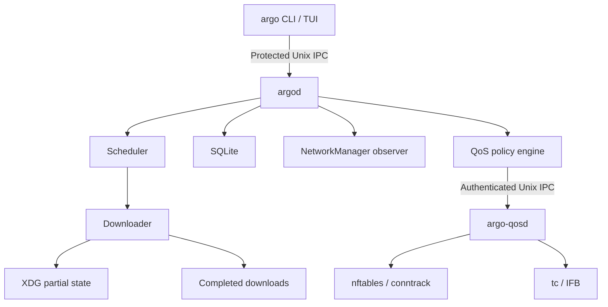

## `argo`

The CLI parses commands, presents output, and sends typed requests. The TUI consumes the same daemon state. Neither interface owns downloads, persistence, or kernel traffic configuration.

## `argod`

The unprivileged user daemon owns lifecycle decisions. It schedules bounded work, executes HTTP and HTTPS transfers, validates resume metadata, persists progress in SQLite, observes NetworkManager, evaluates profiles, and derives desired QoS state.

The daemon socket lives in a private directory. The server validates peer credentials, message size, operation payloads, and request deadlines. Restart recovery moves an interrupted active record to a safe resumable state instead of treating it as complete.

## Downloader and storage

The downloader writes ID-based partial files below Argo's XDG state directory. On completion it validates and publishes to the configured destination. Same-filesystem publication uses rename; cross-filesystem publication stages a destination-side temporary file before the final rename.

SQLite stores download, chunk, validator, profile, and migration state. Scheduler decisions stay outside the storage package.

## `argo-qosd`

The optional system service has a narrow typed IPC protocol for apply, remove, and status behavior. It validates authorization, interface names, numeric limits, cgroup selectors, and desired state before invoking `nft` or `tc` with structured arguments.

The systemd unit limits the helper to `CAP_NET_ADMIN`, prevents privilege gain, protects the filesystem and kernel configuration surfaces where compatible, and restricts address families to Unix and netlink sockets. `argod` itself has an empty capability bounding set.

:::note
Basic downloads do not require the helper. If QoS setup fails, the daemon preserves transfer behavior and reports the policy error unless a future explicit mode requires strict enforcement.
:::
